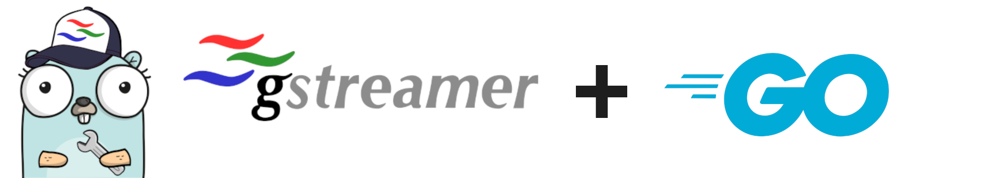

# go-gst: Go bindings for the GStreamer C libraries

[](https://godoc.org/github.com/go-gst/go-gst)
[](https://goreportcard.com/report/github.com/go-gst/go-gst)
<!--  -->

See [pkg.go.dev](https://pkg.go.dev/github.com/go-gst/go-gst) references for documentation and examples.

Please make sure that you have followed the [official gstreamer installation instructions](https://gstreamer.freedesktop.org/documentation/installing/index.html?gi-language=c) before attempting to use the bindings or file an issue.

The bindings are not structured in a way to make version matching with GStreamer easy. We use github actions to verify against the latest supported GStreamer version that is supported by the action https://github.com/blinemedical/setup-gstreamer. Newer GStreamer versions will also work. Always try to use the [latest version of GStreamer](https://gstreamer.freedesktop.org/releases/).

## Requirements

For building applications with this library you need the following:

 - `cgo`: You must set `CGO_ENABLED=1` in your environment when building.
 - `gcc` and `pkg-config`
 - GStreamer development files (the method for obtaining these will [differ depending on your OS](https://gstreamer.freedesktop.org/documentation/installing/index.html?gi-language=c))
   - The core `gst` package utilizes GStreamer core
   - Subpackages (e.g. `app`, `video`) will require development files from their corresponding GStreamer packages
     - Look at `pkg_config.go` in the imported package to see which C libraries are needed.

### Windows

Compiling on Windows may require some more dancing around than on macOS or Linux.
First, make sure you have [mingw](https://chocolatey.org/packages/mingw) and [pkgconfig](https://chocolatey.org/packages/pkgconfiglite) installed (links are for the Chocolatey packages).
Next, go to the [GStreamer downloads](https://gstreamer.freedesktop.org/download/) page and download the latest "development installer" for your MinGW architecture. 
When running your applications on another Windows system, they will need to have the "runtime" installed as well.

Finally, to compile the application you'll have to manually set your `PKG_CONFIG_PATH` to where you installed the GStreamer development files.
For example, if you installed GStreamer to `C:\gstreamer`:

```ps
PS> $env:PKG_CONFIG_PATH='C:\gstreamer\1.0\mingw_x86_64\lib\pkgconfig'
PS> go build .
```

## Quickstart

See the `examples` folder [here](examples/).

## Contributing

The bindings are mostly auto generated from GStreamer documentation files (GIR Files). If a function is missing that you need, please open an issue or manually implement them. Oftentimes the generator is missing some conversion function.

## Where are the v1.X.X versions?

In https://github.com/go-gst/go-gst/pull/170 this repo was migrated to using a generator from GIR files. This makes all code in this repo:

* safer
* more aligned with the GStreamer functions
* way easier to maintain

The old code isn't gone, you can always pin your versions on the old commits. The tags have been retracted though, so you may end up seeing some logs from the go toolchain complaining.

There are some migrations needed, as this is a breaking change, but mostly this is simple syntax or function naming. The underlying GStreamer logic does not change from this. See the [go-gst examples](https://github.com/go-gst/go-gst/tree/main/examples) for some reference.
